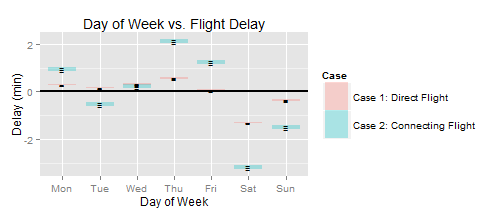

## Abstract

This study is inspired by the web application and study by Ritchie King and Nate Silver at fivethirtyeight.com titled *Which Flight Will Get You There Fastest?*.  The web application can be found [here](http://projects.fivethirtyeight.com/flights/).  The accompanying [documentation](http://fivethirtyeight.com/features/how-we-found-the-fastest-flights/) describes what they mean by "fastest" flights: 

> Airline A says it will fly you from Seattle to Portland, Oregon, in 45 minutes, but actually takes 60 minutes.  Airline B says it will fly the same route in 75 minutes, and actually takes 70 minutes.  Which flight would you rather take?  That seems easy. Airline A!

My criticism of this approach is that it does not consider connecting passengers who should prioritize scheduling over pure speed.  If a passenger is travelling from SEA-PDX-HNL (Seattle - Portland - Honolulu) - timing that connection in Portland is important!  If both airlines schedule a mere 10 minutes between flights the passenger misses the connection with Airline A, but has a total of 15 minutes to make their connection with Airline B.  I therefore build models optimizing the two cases.

* **Case 1:** Direct Flight - The consumer wants the fastest flight as defined in the aforementioned study.  This is defined as the difference between the actual arrival time and the target arrival time.
* **Case 2:** Connecting Flight - The consumer wants an on-time flight in order to avoid missing a tight connection.  This is defined as the difference between the actual arrival time and the scheduled arrival time.

I hypothesize that the 3 best and worst airlines for the two cases are different.  To show this, a multivariate regression model will be built for each case to account for confounding variables including **month**, **day of week**, **origin airport**, **destination airport**, and **time of day** in addition to the **airline** variable.


## Introduction

This study utilizes aviation on-time performance data provided by the United States Department of Transportation [here](http://www.transtats.bts.gov/DL_SelectFields.asp?Table_ID=236&DB_Short_Name=On-Time).  The study analyzes **1812011** flights and includes hundreds of dummy variables in the culminating multivariate regression model comparing Cases 1 and 2.  **Case 2** will use the *ARR_DELAY* field to compare against scheduled arrivals.  **Case 1** will use the difference between the gate-to-gate flight time (*ACTUAL_ELAPSED_TIME* field) and the **target time**.  I calculate target time using the simplified formula shown by Ritchie King and Nate Silver.  

$target time = 0.117 * distance + 0.517 * (lon origin - lon dest) + 43.2$  

This formula produces an estimated travel time in minutes.  **distance** is the Great Circle Distance (shortest distance between two points on the surface of a sphere) and is provided in the data set.  The coefficient **0.117** indicates that flights travel at 513 mph.  **lonorigin** and **londest** represent the longitudes of the originating and destination airports.  30 seconds of flight time is added for every degree of westbound longitude travelled.  The constant **43.2** indicates the time airlines budget for taxiing and inefficient routing (flying around severe weather).

In the interest of conciseness, the code used to produce these results is omitted from this report; however, it is available in the R Markdown file used to produce this report [here](https://github.com/joshuaadampoirier/Aviation_On-Time_Performance_Analysis).  Let's take a look at the first few rows of the raw data!


|MONTH |DAY_OF_WEEK |CARRIER |ORIGIN |DEST |CRS_DEP_TIME | ARR_DELAY|
|:-----|:-----------|:-------|:------|:----|:------------|---------:|
|1     |3           |AA      |JFK    |LAX  |0900         |        13|
|1     |4           |AA      |JFK    |LAX  |0900         |         1|
|1     |6           |AA      |JFK    |LAX  |0900         |        59|


| ACTUAL_ELAPSED_TIME| DISTANCE|
|-------------------:|--------:|
|                 384|     2475|
|                 389|     2475|
|                 379|     2475|

## Feature Examination

In this section I take an independent look at each feature expected to impact the on-time performance of aircraft.

### Month

The *month* of the flight is expected to impact on-time performance due to the seasonality experienced by the United States.  Airports experiencing harsh winter conditions are expected to perform more poorly during the winter months (December through March).  To show this, let us establish a null hypothesis stating population means for each month are equal while the alternative hypothesis states the means are not equal (the indices 1 through 12 represent January through December).

$H_0: \mu_1 = \mu_2 = \mu_3 = ... = \mu_12$  
$H_\alpha: \mu_1 \neq \mu_2 \neq \mu_3 \neq ... \neq \mu_12$

For this, I compute the 95% confidence interval for the mean delays for each month (less the overall mean).  If all confidence intervals do not include 0 we reject the null hypothesis.  


 

|X  |     Lower1|      Mean1|     Upper1|
|:--|----------:|----------:|----------:|
|1  |  0.8545432|  0.9031737|  0.9518043|
|2  |  0.9032465|  0.9532444|  1.0032422|
|3  | -0.6113358| -0.5719228| -0.5325098|
|4  | -1.0916424| -1.0531923| -1.0147423|


|X  |    Lower2|     Mean2|    Upper2|
|:--|---------:|---------:|---------:|
|1  |  4.512049|  4.654241|  4.796433|
|2  |  1.411596|  1.540049|  1.668503|
|3  | -2.264782| -2.165042| -2.065302|
|4  | -3.466254| -3.365328| -3.264401|

Since the confidence intervals for each month do not all contain 0 we reject the null hypothesis and state that the mean delays for each month are not equal.  This makes them strong candidates for features to be included in the regression model (further analysis will be performed during the modeling).

### Day of the Week

The *day of week* of the flight is expected to impact on-time performance due to employee scheduling, and different types of passengers for different days of the week.  Airport/airline staff do not work seven days per week so it is fair to suggest there may be fluctuations in airport/airline efficiencies due to staffing levels as well as the experience and efficiency of staff on duty.  Business travellers are expected to be more likely on week days; while, personal travellers (including families) are expected to be more likely on weekends.  The type of passenger (not recorded in this data set) may generate small departure delays due to increased boarding times and ultimately scheduled arrival delays.  For each case I establish a null hypothesis stating that the mean delays for each day of the week are equal while the alternative hypothesis states they are not all equal (the indices 1 through 7 represent Monday through Sunday).

$H_0: \mu_1 = \mu_2 = \mu_3 = ... = \mu_7$  
$H_\alpha: \mu_1 \neq \mu_2 \neq \mu_3 \neq ... \neq \mu_7$

For this, I compute the 95% confidence interval for the mean delays for each day of the week (less the overall mean).  If all confidence intervals do not include 0 we reject the null hypothesis.


 

|X   |     Lower1|      Mean1|     Upper1|
|:---|----------:|----------:|----------:|
|Mon | -0.1108216| -0.0544967|  0.0018282|
|Tue | -0.2303638| -0.1732334| -0.1161029|
|Wed |  0.1288225|  0.1857877|  0.2427530|
|Thu |  0.7235494|  0.7832166|  0.8428837|
|Fri | -0.0900403| -0.0350488|  0.0199426|
|Sat | -0.7867062| -0.7235566| -0.6604071|
|Sun | -0.1924484| -0.1336164| -0.0747844|


|X   |     Lower2|      Mean2|     Upper2|
|:---|----------:|----------:|----------:|
|Mon | -0.1562590| -0.0040155|  0.1482279|
|Tue | -2.7301665| -2.5880627| -2.4459590|
|Wed | -0.4255603| -0.2766170| -0.1276736|
|Thu |  2.0393685|  2.1975444|  2.3557204|
|Fri |  1.6335672|  1.7905640|  1.9475608|
|Sat | -1.0665237| -0.8910790| -0.7156344|
|Sun | -0.7267779| -0.5689149| -0.4110519|

As shown in the above plot and tables, not all of the confidence intervals include 0.  Therefore, we reject the null hypothesis and consider it a strong candidate for inclusion in the final regression model.

### Origin Airport

### Destination Airport

### Time of Departure

The *time of day* of the flight is expected to impact on-time performance.  A possible mechanism for this is that aircraft typically service multiple flights per day.  Delayed flights in the morning will have a cascading effect on later flights using the same aircraft.  For this analysis we cut the continuous time data into **Morning** (05:00-11:59), **Afternoon** (12:00-17:59), and **Evening** (18:00-23:59 and 00:00-04:59) to match filtering options offered by flight retailers such as [Expedia](https://www.expedia.com/).

### Airline

## Reusable Code


```r
library(ggplot2)
library(reshape2)

# merge dataframes of two cases and clean data
df <- inner_join(df1, df2, by="X")
df <- melt(df, id.vars="X")
df$variable <- as.character(df$variable)
df$Case <- as.factor(substr(df$variable, nchar(df$variable), nchar(df$variable)))
levels(df$Case) <- c("Case 1: Direct Flight", "Case 2: Connecting Flight")

# plot confidence interval data for the two cases
ggplot(df, aes(X, value, col=Case)) + 
    geom_line(size=10, alpha=0.3) + geom_point(col="black", size=5, pch="-") +
    geom_hline(yintercept=0, size=1) +
    labs(title=t, x=xl, y="Delay (min)")

# output confidence interval table for the two cases
knitr::kable(df1, caption="Case 1: Direct Flight")
knitr::kable(df2, caption="Case 2: Connecting Flight")
```
