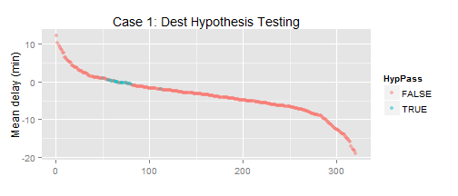
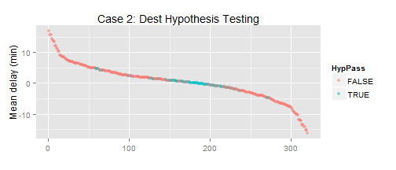
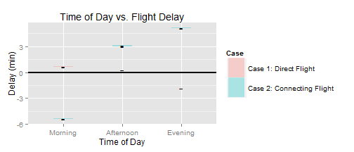

## Abstract

This study is inspired by the web application and study by Ritchie King and Nate Silver at fivethirtyeight.com titled *Which Flight Will Get You There Fastest?*.  The web application can be found [here](http://projects.fivethirtyeight.com/flights/).  The accompanying [documentation](http://fivethirtyeight.com/features/how-we-found-the-fastest-flights/) describes what they mean by "fastest" flights: 

> Airline A says it will fly you from Seattle to Portland, Oregon, in 45 minutes, but actually takes 60 minutes.  Airline B says it will fly the same route in 75 minutes, and actually takes 70 minutes.  Which flight would you rather take?  That seems easy. Airline A!

My criticism of this approach is that it does not consider connecting passengers who should prioritize scheduling over pure speed.  If a passenger is travelling from SEA-PDX-HNL (Seattle - Portland - Honolulu) - timing that connection in Portland is important!  If both airlines schedule a mere 10 minutes between flights the passenger misses the connection with Airline A, but has a total of 15 minutes to make their connection with Airline B.  I therefore build models optimizing the two cases.

* **Case 1:** Direct Flight - The consumer wants the fastest flight as defined in the aforementioned study.  This is defined as the difference between the actual arrival time and the target arrival time.
* **Case 2:** Connecting Flight - The consumer wants an on-time flight in order to avoid missing a tight connection.  This is defined as the difference between the actual arrival time and the scheduled arrival time.

I hypothesize that the 3 best airlines for the two cases are different.  To show this, a multivariate regression model will be built for each case to account for confounding variables including **month**, **day of week**, **origin airport**, **destination airport**, and **time of day** in addition to the **airline** variable.


## Introduction

This study utilizes aviation on-time performance data for the 2014 calendar year provided by the United States Department of Transportation [here](http://www.transtats.bts.gov/DL_SelectFields.asp?Table_ID=236&DB_Short_Name=On-Time).  The study analyzes **5668642** flights and includes hundreds of dummy variables in the culminating multivariate regression model comparing Cases 1 and 2.  **Case 2** will use the *ARR_DELAY* field to compare against scheduled arrivals.  **Case 1** will use the difference between the gate-to-gate flight time (*ACTUAL_ELAPSED_TIME* field) and the **target time**.  I calculate target time using the simplified formula shown by Ritchie King and Nate Silver.  

$target time = 0.117 * distance + 0.517 * (lon origin - lon dest) + 43.2$  

This formula produces an estimated travel time in minutes.  **distance** is the Great Circle Distance (shortest distance between two points on the surface of a sphere) and is provided in the data set.  The coefficient **0.117** indicates that flights travel at 513 mph.  **lonorigin** and **londest** represent the longitudes of the originating and destination airports.  30 seconds of flight time is added for every degree of westbound longitude travelled.  The constant **43.2** indicates the time airlines budget for taxiing and inefficient routing (flying around severe weather).

In the interest of conciseness, the code used to produce these results is omitted from this report; however, it is available in the R Markdown file used to produce this report [here](https://github.com/joshuaadampoirier/Aviation_On-Time_Performance_Analysis).  Let's take a look at the first few rows of the raw data!


|MONTH |DAY_OF_WEEK |CARRIER |ORIGIN |DEST |CRS_DEP_TIME | ARR_DELAY|
|:-----|:-----------|:-------|:------|:----|:------------|---------:|
|Jan   |3           |AA      |JFK    |LAX  |0900         |        13|
|Jan   |4           |AA      |JFK    |LAX  |0900         |         1|
|Jan   |6           |AA      |JFK    |LAX  |0900         |        59|


| ACTUAL_ELAPSED_TIME| DISTANCE|
|-------------------:|--------:|
|                 384|     2475|
|                 389|     2475|
|                 379|     2475|

## Model Building


**Month**, **Day of Week**, **Origin airport**, **Destination airport**, and **Scheduled departure time** are confounders which are included in the linear regression model in addition to **airline/carrier**.  The **APPENDIX** analyzes these confounders on an independent basis to illustrate that they indeed impact on-time flight performance using hypothesis tests and confidence intervals.  

Due to the computational complexity and size of the data set, a single linear regression model could not be computed using the entire data set.  As such, I will apply the Monte Carlo method to build **15** linear regression models for each case based on random **0.5**% samples of the data set (without replacement).  The null hypothesis states that the means for each airline (for each case) are equal; while, the alternate hypothesis states that the means are not equal.

$H_0: \mu_1 = \mu_2 = \mu_3 = ... = \mu_n$  
$H_\alpha: \mu_1 \neq \mu_2 \neq \mu_3 \neq ... \neq \mu_n$

To evaluate the null hypothesis I compute the 95% confidence interval of the mean delay for each case.  If the confidence intervals do not all overlap we reject the null hypothesis.


|Carrier |     Lower1|     Mean1|     Upper1|     Lower2|      Mean2|     Upper2|
|:-------|----------:|---------:|----------:|----------:|----------:|----------:|
|AS      |  2.2396921|  2.494595|  2.7494990| -2.6222041| -2.0107379| -1.3992716|
|B6      | -2.1178802| -1.880114| -1.6423480|  1.5087362|  2.2992006|  3.0896649|
|DL      | -1.4854887| -1.275544| -1.0655990| -1.3732994| -0.7343473| -0.0953953|
|EV      |  1.5043176|  1.706531|  1.9087452|  5.8568322|  6.3471378|  6.8374433|
|F9      | -1.4175814| -1.059608| -0.7016352|  5.1210448|  6.0479401|  6.9748354|
|FL      | -3.2597187| -3.032865| -2.8060103| -2.8602339| -1.7472234| -0.6342130|
|HA      |  3.1017473|  3.849066|  4.5963856|  0.2651329|  2.4433098|  4.6214866|
|MQ      |  2.6623434|  2.825195|  2.9880473|  3.2541276|  3.8211012|  4.3880749|
|OO      |  4.2412766|  4.452050|  4.6628237|  3.3374042|  3.9206366|  4.5038691|
|UA      | -1.2674869| -1.080015| -0.8925422| -1.9260330| -1.4206524| -0.9152717|
|US      |  0.9068061|  1.112096|  1.3173854| -2.4802025| -1.8862361| -1.2922696|
|VX      | -2.5332316| -2.232515| -1.9317990| -4.3717503| -3.4788196| -2.5858890|
|WN      | -3.4965420| -3.346457| -3.1963728|  5.6231258|  6.2853531|  6.9475803|

The above table shows that the confidence intervals (ranging from the value *Lower1* to *Upper1* and *Lower2* to *Upper2* for Case 1: Direct and Case2: Connecting respectively) do not overlap; therefore, we reject the null hypothesis and state that the airline/carrier impacts the on-time flight performance for both cases.

## Conclusions

The top 3 airlines for Case 1: Optimizing for a direct flight, and Case 2: Optimizing for a connecting flight are shown below.


|Airline                     | Mean Delay (min)|
|:---------------------------|----------------:|
|Southwest Airlines Co.      |        -3.346457|
|AirTran Airways Corporation |        -3.032865|
|Virgin America              |        -2.232515|


|Airline                                                                             | Mean Delay (min)|
|:-----------------------------------------------------------------------------------|----------------:|
|Virgin America                                                                      |        -3.478820|
|Alaska Airlines Inc.                                                                |        -2.010738|
|US Airways Inc. (Merged with America West 9/05. Reporting for both starting 10/07.) |        -1.886236|

The hypothesis is thereby confirmed as the top 3 airlines for on-time performance for the two cases are not the same.  Southwest Airlines Co. on average arrives at their destination 3.35 minutes early relative to an independently calculated target time (**Case 1: Direct Flight Optimization**).  Virgin America on average arrives at their destination 3.48 minutes early relative to their own scheduling (**Case 2: Connecting Flight Optimization**) - making them the best option for a connecting flight.

# APPENDIX

In this section I take an independent look at each feature expected to impact the on-time performance of aircraft.

### Month

The *month* of the flight is expected to impact on-time performance due to the seasonality experienced by the United States.  Airports experiencing harsh winter conditions are expected to perform more poorly during the winter months (December through March).  To show this, let us establish a null hypothesis stating population means for each month are equal while the alternative hypothesis states the means are not equal (the indices 1 through 12 represent January through December).

$H_0: 0 = \mu_1 = \mu_2 = \mu_3 = ... = \mu_12$  
$H_\alpha: 0 \neq \mu_1 \neq \mu_2 \neq \mu_3 \neq ... \neq \mu_12$

For this, I compute the 95% confidence interval for the mean delays for each month (less the overall mean).  If all confidence intervals do not include 0 we reject the null hypothesis.  


```
## Warning in loop_apply(n, do.ply): Removed 48 rows containing missing
## values (geom_point).
```

 

|X   |     Lower1|      Mean1|     Upper1|
|:---|----------:|----------:|----------:|
|Apr | -0.3439720| -0.3055219| -0.2670718|
|Aug | -1.0397174| -1.0005983| -0.9614792|
|Dec |  1.2817520|  1.3235204|  1.3652887|
|Feb |  1.6509170|  1.7009148|  1.7509126|
|Jan |  1.6022136|  1.6508441|  1.6994747|
|Jul | -1.2192006| -1.1797419| -1.1402832|
|Jun | -0.3530627| -0.3126617| -0.2722607|
|Mar |  0.1363346|  0.1757476|  0.2151606|
|May | -0.7295740| -0.6906373| -0.6517007|
|Nov |  0.5646222|  0.6059121|  0.6472019|
|Oct | -0.4319433| -0.3939462| -0.3559492|
|Sep | -1.0583849| -1.0202735| -0.9821622|


|X   |     Lower2|      Mean2|     Upper2|
|:---|----------:|----------:|----------:|
|Apr | -2.7052749| -2.6043484| -2.5034219|
|Aug | -0.2953312| -0.1882527| -0.0811743|
|Dec | -0.0042859|  0.1090870|  0.2224599|
|Feb |  2.1725748|  2.3010286|  2.4294824|
|Jan |  5.2730286|  5.4152202|  5.5574119|
|Jul |  1.3416754|  1.4532325|  1.5647895|
|Jun |  4.2076928|  4.3295213|  4.4513498|
|Mar | -1.5038025| -1.4040625| -1.3043225|
|May | -0.1914828| -0.0782169|  0.0350490|
|Nov | -3.3965155| -3.2941590| -3.1918025|
|Oct | -2.4122769| -2.3132325| -2.2141881|
|Sep | -3.4312881| -3.3325017| -3.2337153|

Since the confidence intervals for each month do not all contain 0 we reject the null hypothesis and state that the mean delays for each month are not equal.  Therefore we include **Month** as a variable in the final model.

### Day of the Week

The *day of week* of the flight is expected to impact on-time performance due to employee scheduling, and different types of passengers for different days of the week.  Airport/airline staff do not work seven days per week so it is fair to suggest there may be fluctuations in airport/airline efficiencies due to staffing levels as well as the experience and efficiency of staff on duty.  Business travellers are expected to be more likely on week days; while, personal travellers (including families) are expected to be more likely on weekends.  The type of passenger (not recorded in this data set) may generate small departure delays due to increased boarding times and ultimately scheduled arrival delays.  For each case I establish a null hypothesis stating that the mean delays for each day of the week are equal to 0; while, the alternative hypothesis states they are not all equal (the indices 1 through 7 represent Monday through Sunday).

$H_0: 0 = \mu_1 = \mu_2 = \mu_3 = ... = \mu_7$  
$H_\alpha: 0 \neq \mu_1 \neq \mu_2 \neq \mu_3 \neq ... \neq \mu_7$

For this, I compute the 95% confidence interval for the mean delays for each day of the week (less the overall mean).  If all confidence intervals do not include 0 we reject the null hypothesis.


 

|X   |     Lower1|      Mean1|     Upper1|
|:---|----------:|----------:|----------:|
|Mon |  0.2575274|  0.2889394|  0.3203515|
|Tue |  0.1328629|  0.1642519|  0.1956409|
|Wed |  0.2880309|  0.3193594|  0.3506879|
|Thu |  0.5397802|  0.5716058|  0.6034313|
|Fri |  0.0355396|  0.0657659|  0.0959923|
|Sat | -1.3374894| -1.3050375| -1.2725857|
|Sun | -0.3838551| -0.3531097| -0.3223643|


|X   |     Lower2|      Mean2|     Upper2|
|:---|----------:|----------:|----------:|
|Mon |  0.8444892|  0.9315342|  1.0185792|
|Tue | -0.6085968| -0.5249788| -0.4413607|
|Wed |  0.1454752|  0.2290800|  0.3126849|
|Thu |  2.0490879|  2.1368254|  2.2245628|
|Fri |  1.1665000|  1.2514512|  1.3364024|
|Sat | -3.2856481| -3.1984772| -3.1113064|
|Sun | -1.5712698| -1.4883897| -1.4055095|

As shown in the above plot and tables, not all of the confidence intervals include 0.  Therefore, we reject the null hypothesis and include **Day of Week** as a variable in the final model.

### Origin Airport

Airports are a key factor impacting the on-time performance of flights.  Design, length of taxi, traffic volume are but some of the airport-specific features contributing to on-time flight performance.  The data set being analyzed features 322 origin airports.  As a result we'll visualize it a bit differently.  We still perform a hypothesis testing (the indices represent different airports).

$H_0: 0 = \mu_1 = \mu_2 = \mu_3 = ... = \mu_n$  
$H_\alpha: = \neq \mu_1 \neq \mu_2 \neq \mu_3 \neq ... \neq \mu_n$

For this, I compute the 95% confidence interval for the mean delays for each day of the week (less the overall mean).  If all confidence intervals do not include 0 we reject the null hypothesis.


```
## Warning in loop_apply(n, do.ply): Removed 2 rows containing missing values
## (geom_point).
```

 

```
## Warning in loop_apply(n, do.ply): Removed 2 rows containing missing values
## (geom_point).
```

 

The above plots show that some of the origin airport categories *pass* the hypothesis test; however, the hypothesis test states that the mean for each origin airport must be 0 in order to pass.  Since many of the airports fail the test, we reject the null hypothesis and include the origin airport as a variable in the model.

### Destination Airport

Airports are a key factor impacting the on-time performance of flights.  Design, length of taxi, traffic volume are but some of the airport-specific features contributing to on-time flight performance.  The data set being analyzed features 321 destination airports.  As a result we'll visualize it a bit differently.  We still perform a hypothesis testing (the indices represent different airports).

$H_0: 0 = \mu_1 = \mu_2 = \mu_3 = ... = \mu_n$  
$H_\alpha: = \neq \mu_1 \neq \mu_2 \neq \mu_3 \neq ... \neq \mu_n$

For this, I compute the 95% confidence interval for the mean delays for each day of the week (less the overall mean).  If all confidence intervals do not include 0 we reject the null hypothesis.


```
## Warning in loop_apply(n, do.ply): Removed 1 rows containing missing values
## (geom_point).
```

 

```
## Warning in loop_apply(n, do.ply): Removed 1 rows containing missing values
## (geom_point).
```

 

The above plots show that some of the destination airport categories *pass* the hypothesis test; however, the hypothesis test states that the mean for each origin airport must be 0 in order to pass.  Since many of the airports fail the test, we reject the null hypothesis and include the destination airport as a variable in the model.

### Time of Departure

The *time of day* of the flight is expected to impact on-time performance.  A possible mechanism for this is that aircraft typically service multiple flights per day.  Delayed flights in the morning will have a cascading effect on later flights using the same aircraft.  For this analysis we cut the continuous time data into **Morning** (05:00-11:59), **Afternoon** (12:00-17:59), and **Evening** (18:00-23:59 and 00:00-04:59) to match filtering options offered by flight retailers such as [Expedia](https://www.expedia.com/).  For each case (Direct vs. Connecting) I establish a null hypothesis stating that the mean delays for each time of day category are equal to 0; while, the alternative hypothesis states they are not all equal (the indices 1 through 3 indicate morning, afternoon, and evening).

$H_0: 0 = \mu_1 = \mu_2 = \mu_3 = ... = \mu_7$  
$H_\alpha: 0 \neq \mu_1 \neq \mu_2 \neq \mu_3 \neq ... \neq \mu_7$

For this, I compute the 95% confidence interval for the mean delays for each day of the week (less the overall mean).  If all confidence intervals do not include 0 we reject the null hypothesis.


 

|X         |     Lower1|      Mean1|     Upper1|
|:---------|----------:|----------:|----------:|
|Morning   |  0.6388138|  0.6569439|  0.6750740|
|Afternoon |  0.2853535|  0.3051130|  0.3248726|
|Evening   | -1.8622814| -1.8368558| -1.8114301|


|X         |    Lower2|     Mean2|    Upper2|
|:---------|---------:|---------:|---------:|
|Morning   | -5.468142| -5.423063| -5.377983|
|Afternoon |  3.004334|  3.059627|  3.114921|
|Evening   |  5.067423|  5.142485|  5.217547|

Interestingly we observe opposite relationships between the two cases.  This may reflect shifting scheduled flight times to accommodate varying taxi times, and weather patterns (midday convective currents for example) throughout the day.  Since not all of the 95% confidence intervals include 0, we reject the null hypothesis and include the variable in the final model.


